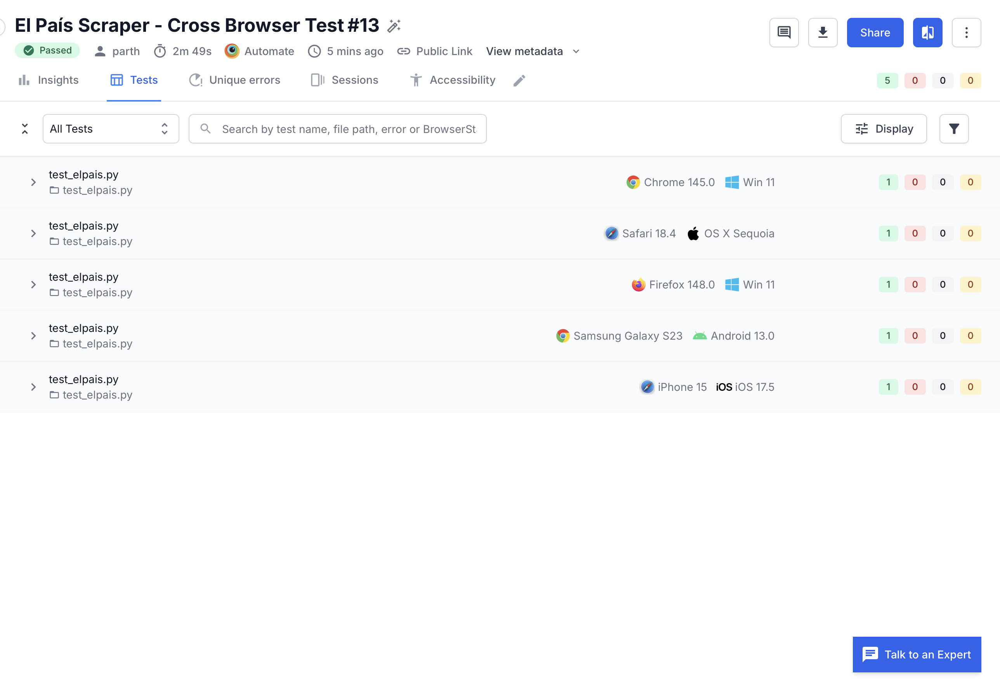

HOW TO RUN THIS: 

1. Install dependencies from requirements.txt using 'pip install -r requirements.txt'

2. Update your credentials and build settings in **browserstack.yml**:

```yaml
userName: YOUR_USERNAME
accessKey: YOUR_ACCESS_KEY
buildIdentifier: "#${BUILD_NUMBER}"
```
*(You can also set these as environment variables BROWSERSTACK_USERNAME and BROWSERSTACK_ACCESS_KEY)*


3. run scraper.py
4. run 'browserstack-sdk pytest test_elpais.py -v -s' for browserstack testing
5. run 'pytest test_elpais.py -v -s' for local testing

**To view Public Test Results visit:** 
https://automate.browserstack.com/projects/El+Pa%C3%ADs+Opinion+Scraper/builds/El+Pa%C3%ADs+Scraper+Cross+Browser+Test/13?tab=unique_errors&public_token=3fc733d557136e675ce67a5a526bd732641aa9d2a5e37e677ca6bd58d07928e8

**Screenshot of Build Running on Google Drive** 
https://drive.google.com/file/d/1O4che2Ubw6P8UNcX93fC8lfOWLIVtghY/view?usp=sharing

**Screenshot of the build running:** 



**To View Google Drive Folder with Test Results and presentation:** 
https://drive.google.com/drive/folders/1hduQ1Nm2KXe-Hv61ZEdGBre5tS4RTFB7?usp=sharing

